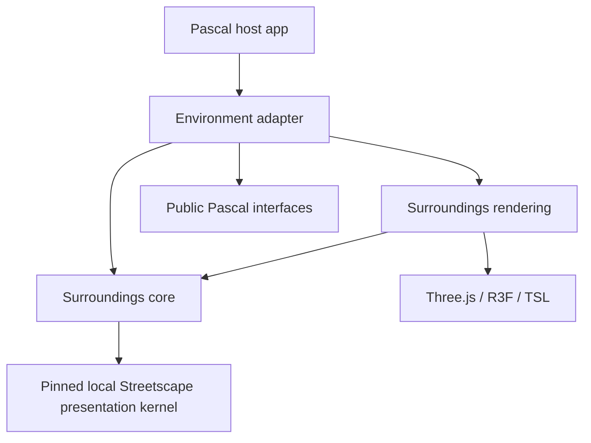
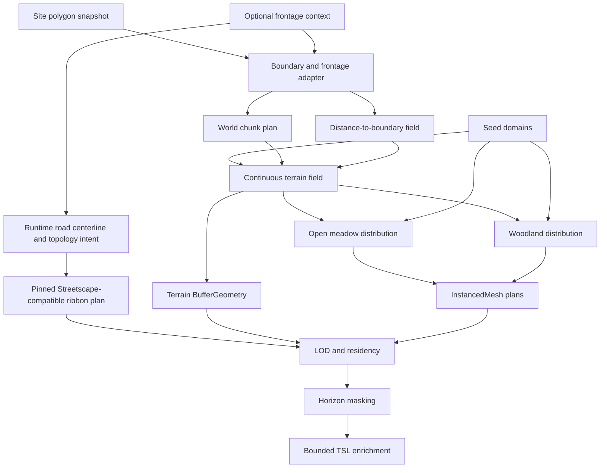

# Procedural Surroundings — Runtime Contract

> Status: refreshed scope and topology approved; E0–E2D are implemented and human-accepted. E2E-A replaces road-dependent property rectangles with a deterministic candidate-cell ring containing frontage cells and explicit convex-corner cells around the complete Site, even when no road is selected. The cell substrate is rendered in the camera-relative 2D preview and under the disposable 3D presentation root. Streetscape remains the visual reference for roads, but the plugins are intentionally independent: Environment may carry a pinned local copy of the pure presentation algorithms required for junction parity. No package patch or private runtime import is allowed. Human visual acceptance of the final junction result remains open.
> Source of planning truth: `docs/mission/SIX-DAY-PLAN.md`, especially “Frontages du Site et contexte de voisinage”.

## Mission

Build a deterministic, runtime-generated presentation layer beyond the Pascal Site polygon. The first accepted experience provides `Prairie ouverte` and `Lisière boisée`: continuous exterior terrain, deterministic vegetation and a naturally masked horizon while preserving the authoring document, node evaluation, bake and export.

The Site polygon is authoritative. Its segments may also carry optional frontage context—no road, secondary road or primary road—so a Sims-like suburb mode can place a Streetscape-consistent visual corridor between the active property and nearby derived properties. A time-boxed evening demonstrator may bring this forward as a presentation-only blockout with simple house-shell proxies. Environment's rectangular E2 roads are topology diagnostics only. Because Environment and Streetscape have no runtime interconnection, the bounded road proof may carry a pinned local copy of Streetscape's pure cross-section, transition, junction-boundary and marking algorithms. Environment adapts its disposable frontage axes to that local kernel without creating an authored road node. Generated houses and PLU remain deferred.

The system is not an asset generator and not a second scene graph. It derives disposable presentation from read-only Pascal output.

```text
Pascal Site polygon + Terrain snapshot + runtime preset/frontages
                              ↓ read only
                   surroundings generator
                              ↓
                      SurroundingsLayer
```

## Craft and learning contract

This project is built as a craftsman apprenticeship.

- Adam owns polygon/frontage reasoning, consequential TypeScript and TSL mechanisms, terrain character, vegetation grammar, horizon composition and perceptual acceptance.
- The agent owns repository research, scaffolds, schemas, fixtures, red tests, repetitive integration, diagnostics and measurements.
- A production algorithm written by the agent must be explicitly labelled as agent-authored and does not count as learner evidence.
- Each slice changes one conceptual variable and reaches a visible result quickly. In an explicit low-energy pairing session, the agent may author the bounded production slice while Adam only validates the visible result; cold probes and explain-backs are deferred, and the code is not recorded as learner evidence.

The detailed sequence lives in `LEARNING-PATH.md`.

## Architectural roots

```text
THREE.Scene
├── scene-renderer                         AuthoringRoot de facto
└── environment-surroundings-root          presentation-derived
    ├── exterior-terrain-chunks
    ├── ground-cover-clusters
    ├── vegetation-clusters
    ├── horizon-geometry
    └── streetscape-road-presentation
```

Invariants:

1. `environment-surroundings-root` is mounted through the public `Editor.viewerSceneSlot` / `Viewer.children` seam.
2. It is never a child of `scene-renderer`, a Pascal node group or the active `site` group.
3. No surroundings object receives a `pascalId` or registration in `sceneRegistry`.
4. Bake and export continue to start from `scene-renderer` only.
5. Disabling or regenerating the layer cannot mutate `useScene.nodes`, `rootNodeIds`, materials, collections or node metadata.
6. The layer owns and disposes its transient resources independently.

The first implementation may use the existing named authoring root. A typed `AuthoringRoot` reference is a hardening task, not a prerequisite, unless a tracer-bullet test proves the current public seam insufficient.

## Dependency direction



| Module | May know | Must not know |
|---|---|---|
| surroundings core | plain values, arrays, deterministic rules, pinned Streetscape-derived presentation algorithms | React, Three.js scene objects, Pascal stores, runtime imports from Streetscape |
| surroundings rendering | core output, Three.js, R3F, TSL | editor internals, scene mutation, Streetscape author renderer |
| Environment adapter | core/rendering and public Pascal interfaces | private deep imports from `editor/` or Streetscape |
| pinned Streetscape presentation kernel | copied `local-street`/`collector` values, cross-sections, transition profiles, junction boundaries, regional rules and markings from the pinned commit | React, stores, registry, selection, authored nodes, history, bake/export hooks, bridges, earthworks or decorations |
| Pascal host | generic composition through `viewerSceneSlot` | frontage classification, terrain-noise or vegetation-generation rules |

Do not modify Pascal or Streetscape for this slice. Keep the copied algorithms structurally isolated and record their exact source commit so later parity fixes can be ported intentionally.

## Operator graph



### Boundary and frontage adapter

Input: a read-only `SiteNode.polygon.points` snapshot and optional runtime frontage context.

The adapter preserves the original segment order. For segment `i`, it exposes its endpoints, tangent, length, polygon winding and outward normal. It never assumes that the Site is square, convex or centered at the origin.

Each segment can receive:

```text
separator: none | secondary-road | primary-road
access: none | driveway | pedestrian-path
roadStyleId?: string
```

Each edge is configured through its own explicit native selector. Selecting a value applies that separator directly; cycling through values by repeated diagram or button clicks is not part of the interaction contract. The diagram itself is visual rather than a hidden state-changing control.

The selector uses Pascal’s floorplan convention: world `-Z` is screen-up at camera azimuth zero, and one group containing the Site, roads, cells, junctions and frontage diagnostics rotates by the public `navigationSyncPose.azimuth`. A diagonal square overscan keeps the complete exterior layout visible through rotation. No Environment deep import of floorplan implementation helpers is allowed.

Separator and access are independent: a road may run along a property edge while a driveway or path crosses it at a specific station.

Current Site polygons expose point arrays without stable vertex or edge IDs. Segment indices are valid only for the current polygon snapshot. Runtime-only frontage selection may use them; durable project persistence requires a stable frontage identity or generic project sidecar.

### Topology decision

The runtime deliberately combines three scales:

1. continuous polygon frontages carry human-authored boundary conditions;
2. a small derived neighbor band may classify immediate properties across those frontages;
3. world-addressed chunks and distance bands carry terrain, vegetation, LOD and residency.

The nearby cells do not define road width or terrain shape. Exact road corridors and terrain remain continuous world-space geometry so a coarse grid cannot quantize visible dimensions.

### Seed domains

A master seed derives independent domains:

```text
terrain · meadow · flowers · woodland · archetype · style · horizon
```

Spatial variation is addressed by world coordinate and semantic domain. It must not consume one mutable PRNG stream in traversal order. Expanding the chunk window or changing iteration order must not move existing samples.

### World chunk plan

Chunks use canonical integer keys derived from world coordinates. Exterior extent adds or removes outer keys without changing inner keys. Chunk size is an operational constant until measurement proves an artist-facing control is useful.

A chunk can be regenerated independently from the same snapshots and seed domains. Caches are disposable and carry no authored information.

### Distance-to-boundary field

For each exterior sample, the field provides the nearest point and segment on the Site boundary plus unsigned exterior distance. It is based on the polygon contour, not distance from a Site center.

The result drives the Terrain transition band and can influence representation, but it must not create visible concentric geometry.

### Continuous exterior terrain

`heightAtWorld(x, z, terrainSeed)` is CPU-authoritative and sampled in world coordinates.

- Shared world coordinates return bit-identical border heights.
- At the Site boundary, the transition reproduces the Pascal Terrain sample.
- Pascal influence decreases through an intentional distance-based transfer curve.
- Macro relief grows outward without mutating the Site Terrain.
- TSL may add bounded visual micro-relief, but placement, bounds and culling remain based on CPU geometry.

The intended elevation stack is staged rather than collapsed into one noise function:

1. exact Site-boundary height matching;
2. a smooth transition collar that releases the authored terrain;
3. deterministic low-frequency landform variation away from the Site;
4. an optional smooth vertical road profile;
5. soft property-level offsets derived relative to their road frontage.

The evening suburb blockout may keep all derived properties at the Site datum or corresponding edge height. NURBS or another spline may later define a road profile or a deliberately directed ridge, but a NURBS surface is not the default representation for the irregular exterior terrain.

### Open meadow distribution

The meadow preset derives deterministic grass clusters and sparse flowers from world-space candidates. Exact repetitions use `InstancedMesh`. The exterior field is distinct from Ground Cover's authored paint map and never pretends that the user painted outside the Site.

### Woodland distribution

The woodland preset uses a continuous world-space density field, deterministic candidates and a small family of presentation-only archetypes.

- Clearings cross chunk borders.
- Near, intermediate and distant representations retain stable world identity.
- Nature's editable trees and EZ-Tree internals are not imported.
- Exact repetitions use `InstancedMesh`.

### Streetscape frontage corridor

A selected road frontage defines a corridor immediately outside the Site boundary. The segment tangent sets road direction and its outward normal sets the exterior side. Environment owns this conversion from Site frontage to disposable centerline/topology intent and owns the lifetime of the copied runtime implementation.

The reference snapshot is `@pascal-app/plugin-streetscape` commit `1c04ec9ccb3fa8124ec56dfc1026567cbbc51aef`. Its pure modules define the cross-sections, transition profiles, automatic degree-three/four junction boundaries, nested side bands, regional rules and markings required for visual parity. Its React renderer and editor integrations remain excluded.

The approved ownership rule is **same source grammar, independent plugin runtime**:

- authored Streetscape roads and generated Environment roads start from the same pinned algorithms and preset values;
- Environment roads remain runtime DTOs under `environment-surroundings-root`, never Pascal scene nodes;
- no generated road receives `pascalId`, registry membership, selection behavior, history, bake or author export;
- Environment does not patch `node_modules`, deep-import Streetscape private files at runtime or mount the editor-aware renderer;
- Environment may copy the pure geometry and presentation dependency closure needed for parity, with provenance and focused parity tests;
- editor validation, selection, mutation, decorations, bridges, earthworks and roadside openings stay outside the copied kernel.

The local presentation contract is a pure descriptor seam:

```ts
type RuntimeRoadNetwork = {
  graphNodes: Record<string, RuntimeRoadGraphNode>
  edges: Record<string, RuntimeRoadGraphEdge>
  junctions: Record<string, RuntimeRoadJunction>
}

type RoadPresentationPlan = {
  surfaces: RoadPresentationSurface[]
}

function buildRoadPresentationPlan(network: RuntimeRoadNetwork): RoadPresentationPlan
```

The graph tracer is implemented as one in-memory `RoadNetworkNode`: primary frontages continue through the candidate-cell ring, secondary approaches meet primaries at shared degree-three nodes, adjacent primaries form shared degree-four crossings, and compatible three-frontage secondary runs retain one curved alignment. Feeder extension is derived from the actual intersection geometry rather than a fixed distance cap, including acute Site corners.

The seven copied Streetscape algorithm files remain byte-identical to commit `1c04ec9ccb3fa8124ec56dfc1026567cbbc51aef`. One deliberate host-specific deviation lives in Environment's presentation adapter after visual rejection of the first junction render: approach carriageways are generated from their clipped transition-profile samples and stop at the approach cuts, so the collector-colored junction footprint is the sole carriageway owner inside the intersection. Streetscape's current untrimmed carriageway underlap produced overlapping triangles, visible depth conflict and black fan artifacts in Pascal's WebGPU host. Indexed mesh normals are therefore also derived from actual triangle winding rather than hard-coded to `+Y`. Closed all-secondary rings additionally reuse one canonical endpoint and cyclic seam tangent for the first/last ribbon samples; treating the loop as an open ribbon produced a diagonal side-band wedge across the road. Mixed primary/secondary junction bands are class-aware in the local adapter: each side-path component matches the source road's width at one approach, interpolates around the curb return, and matches the destination road at the other approach. Components absent from an approach taper to zero there, so the collector's green bike lane still meets collector cuts but does not wrap at full width around the secondary mouth. The copied band definitions still provide component order, material and elevation values; the seven source files remain unchanged. Automated contracts cover T junctions, four-way crossings, markings, finite geometry, acute corners, closed-loop continuity, class-aware mixed bands and the trimmed ownership rule; human visual acceptance of the corrected presentation remains the completion gate.

If the Site boundary coincides with the near outer edge of a road corridor:

```text
neighbor build line = roadWidth + neighborFrontSetback
neighbor house center = roadWidth + neighborFrontSetback + houseDepth / 2
```

The formula is recorded for the optional suburb extension. It does not authorize production house generation in the natural milestone.

### Time-boxed suburb blockout

The evening demonstrator may generate a deliberately coarse, disposable neighborhood before the natural presets are visually complete. Its purpose is to validate frontage composition and the feeling of a world beyond the parcel, not architectural detail.

- The original E2 diagnostic road strip is retained only as pure topology evidence. Retained presentation uses the pinned Streetscape-derived kernel for straight roads, degree-two bends, profiles, junction surfaces, side bands and markings; the old independent-ribbon renderer is not a production fallback.
- A deterministic candidate-cell ring exists independently of road selection: each Site frontage contributes one row of cells and each convex corner contributes one explicit corner cell.
- The ring depth is derived from the widest supported road plus the neighbor depth, leaving enough spatial substrate for roads to traverse cells and for usable residuals to remain beyond them.
- Road selection never moves candidate-cell IDs or polygons. Later topology classifies road occupation, residual buildability and road-relative access before any shell is eligible.
- A few seeded shells use only footprint, height, roof direction and restrained palette variation.
- Doors, windows, interiors, PLU, driveways, collision and semantic selection are excluded.
- The entire blockout remains under `environment-surroundings-root`, runtime-only and absent from bake/export.
- Flat neighbor elevations are acceptable for this proof; the layered elevation stack is the next refinement.

The original E2 calibration remains deliberately provisional and diagnostic: secondary roads are `6 m` wide, primary roads `9 m`, the neighboring depth is `22 m` and the target cell frontage is approximately `8 m`. `src/surroundings/corridor.ts` derives oriented road rectangles and convex-corner junction patches with a bounded miter/bevel rule from `Site.polygon`; those values and patches remain 2D topology evidence only. The selector exposes one explicit native road-type selector per edge and orients its complete SVG scene from Pascal’s public camera azimuth using the same `-Z`-up floorplan convention. Retained presentation uses the copied Streetscape-compatible `10.4 m / 15.7 m` styles and graph-based junction geometry rather than promoting the custom preview patch as 3D geometry.

E2E-A introduces the road-independent spatial substrate required by the approved road-first model. `deriveNeighborCells` emits stable quadrilateral frontage cells across every Site segment and one bounded convex-corner cell between adjacent segments. For the Streetscape-compatible dimensions, the ring depth is `max(10.4 m, 15.7 m) + 22 m = 37.7 m`. The same polygons feed the SVG preview and flat, non-raycastable R3F meshes under `environment-neighbor-cells`. Selecting or changing a road leaves this substrate unchanged. Road graph and presentation failures must not remove valid candidate cells.

### Optical concealment probe

Pascal currently owns a custom WebGPU/TSL `RenderPipeline`; Environment has no public DOF control or selective postprocessing contribution. Standard camera-depth DOF cannot guarantee that every point inside the active Site remains sharp while every surroundings object is blurred.

The desired invariant is nevertheless explicit: author geometry, Site ground, gizmos and overlays remain crisp, while distant suburb silhouettes may soften. A true implementation therefore requires a viewer-owned selective mask/layer or a sharp-authoring composite after blur. The evening spike is time-boxed after blockout geometry. If that seam is not already cheap to expose, the accepted fallback is material simplification plus distance haze and reduced contrast—not a hidden global DOF mutation.

### Representation, horizon and LOD

- Exact repeated vegetation uses `InstancedMesh`.
- TypeScript owns chunk residency, representation choice and bounds.
- TSL may hide transitions visually but does not decide topology.
- The outer window is masked through an approved combination of asymmetric relief, vegetation, silhouettes and horizon softness rather than a circle or uniform wall.
- Road corridors, when enabled, remain presentation-only and stop or transition according to an explicit topology rather than at an arbitrary chunk edge.

## State model

The procedural model is deterministic and analytically reconstructible from:

```text
Site polygon snapshot + Terrain snapshot + preset + quality + seed
+ optional runtime frontage contexts + world coordinates
```

Chunk caches and derived neighbor cells are operational state, not authored state. Every cached result can be deleted and reconstructed without information loss. Stateful WebGPU compute is explicitly rejected for the first version because no accumulated simulation, collision history or neighborhood feedback is required.

Compute may be reconsidered only after measurements for massive tree distribution, instance-buffer generation, culling or vegetation animation.

## CPU/GPU responsibilities

```text
TypeScript / CPU
├── Site boundary and frontage frames
├── world chunks and distance-to-boundary queries
├── authoritative macro terrain and transition band
├── meadow/woodland candidates and matrices
├── optional road-corridor descriptors
├── BufferGeometry, bounds and chunk invalidation
└── horizon/LOD representation plan
              ↓
             InstancedMesh
              ↓
WebGPU / TSL
├── procedural materials
├── colors and visual parameters per instance
├── root-preserving wind and foliage
├── visual LOD transitions
└── bounded world-space micro-relief
```

A GPU displacement must declare its maximum amplitude. Bounds must already contain that amplitude or the displacement must be too small to affect spatial correctness.

## Public runtime configuration

Defaults are provisional until the first visual calibration. Types and domains are contractual.

| Path | Type | Domain | Provisional default | Effect |
|---|---|---|---|---|
| `presetId` | string ID | `open-meadow`, `woodland-edge` | `open-meadow` | selects one parameterized natural composition |
| `seed` | integer | signed 32-bit | `1` | derives all semantic seed domains |
| `extent` | number | calibrated meters | provisional | radius of the generated world-chunk window |
| `reliefAmplitude` | number | `0…12` m | `3` m | maximum macro-relief contribution away from the Site |
| `edgeBlendDistance` | number | positive meters | provisional | distance over which Pascal Terrain influence is released |
| `groundCover.density` | number | `0…1` | provisional | exterior meadow acceptance rate |
| `groundCover.flowerDensity` | number | `0…1` | provisional | independent sparse flower acceptance rate |
| `surroundings.density` | number | `0…1` | provisional | woodland mass/density control |
| `surroundings.lodBias` | number | bounded scalar | provisional | representation-distance bias |
| `presentationHints.horizonSoftness` | number | `0…1` | provisional | non-semantic horizon composition hint |

Derived seed-domain values and chunk dimensions are diagnostic/internal. They do not become artist-facing controls until a user can manipulate them intentionally.

## Persistence

Allowed presentation state:

```text
presetId · seed · extent · reliefAmplitude · edgeBlendDistance
meadow/woodland parameters · optional frontage contexts
```

The first slice keeps this state runtime-only in the Environment store because Pascal has no verified project-scoped presentation sidecar. It must not be hidden in a node or author mesh. Frontage contexts are especially sensitive because `SiteNode.polygon.points` has no stable edge identity. Project persistence remains gated behind a generic host seam.

## Style-only versus topology changes

| Change | May update | Must remain stable |
|---|---|---|
| palette / style seed | material uniforms and instance colors | chunks, terrain and instance positions |
| meadow/woodland density | accepted population instances | chunk keys and terrain seed |
| relief amplitude | exterior terrain vertices and dependent Y placement | XZ candidates and style seed |
| edge blend distance | transition-band terrain vertices | Site boundary and distant field samples |
| extent | added/removed outer chunks | unchanged inner chunk signatures |
| Site polygon | boundary-dependent chunks, frontages and transition | seed-domain definitions |
| one frontage separator | its road/neighbor descriptor | unrelated frontages, terrain and natural populations |
| Streetscape road style | corridor width/material plan and neighbor build line | Site, terrain and natural populations |

## Disposal contract

A regeneration constructs replacement resources before swapping them under `environment-surroundings-root`. Removed resources are disposed after the swap.

- Owned geometry and material resources emit one disposal.
- Shared cache entries use explicit ownership counts.
- `clear()` disposes all remaining cache resources on unmount.
- Ten regeneration/unmount cycles must not produce monotonically increasing renderer memory.

## Performance contract

Initial layer-wide budgets:

| Measurement | Budget |
|---|---|
| draw calls | ≤ 60 stable, shadow pass reported separately |
| visible triangles | ≤ 250,000 |
| owned buffers | ≤ 64 MiB |
| full nominal regeneration p95 | exploratory ≤ 100 ms CPU before swap |
| style-only update p95 | exploratory ≤ 16 ms CPU |

Measurements distinguish boundary/distance queries, terrain generation, meadow/woodland instance planning, optional frontage-road planning, GPU upload and scene swap.

## Required falsifiable contracts

1. Clockwise and counter-clockwise forms of the same polygon derive geometrically outward segment normals.
2. Selecting one frontage changes only its separator/access descriptor.
3. A frontage road corridor lies outside the Site and follows that segment's tangent.
4. For the pinned `local-street` and `collector` snapshots, the derived neighbor build line uses the complete `10.4 m` and `15.7 m` road width plus its setback.
5. The pinned snapshot matches the inspected Streetscape total width, cross-section component order and presentation descriptors for one road.
6. Two adjacent same-style frontage roads produce one render alignment containing straight → tangent bend → straight, with each seam represented once and no retained diagnostic patch.
7. The candidate-cell ring exists around every Site frontage without requiring a selected road, includes explicit bounded cells at convex corners, and keeps identical IDs and polygons when frontage road classifications change.
8. Same snapshots, preset, quality and seeds produce identical ordered output and checksums.
9. Adjacent terrain chunks share bit-identical border heights.
10. Distance zero at the Site contour reproduces the Pascal Terrain edge sample.
11. Surroundings activation and regeneration do not change node count, author serialization or prepared bake/export output.
12. No surroundings or frontage-road object enters `sceneRegistry` or carries `pascalId`.
13. Environment imports no private Streetscape path at runtime, does not modify `node_modules`, and the pinned local kernel imports no editor store, registry, selection, history or export mechanism.
14. A primary/secondary T and adjacent-primary crossing produce shared graph nodes, finite approach cuts, a junction carriageway footprint, continuous side bands and Streetscape-equivalent markings.
15. Every approach carriageway stops at its approach cut, the junction footprint solely owns intersection carriageway coverage, and indexed normals agree with actual triangle winding.
16. An all-secondary closed frontage ring emits one self-loop whose first and last carriageway/side-band boundary vertices are identical, with no diagonal closure wedge.
17. At a primary/secondary T, the collector bike lane reaches each collector cut at its authored offset but tapers to zero at the secondary carriageway edge instead of wrapping around the secondary mouth.
18. Repeated regeneration and unmount release all unowned resources.

## Visual acceptance

Fixed-camera comparisons cover rectangular, rotated and concave Site polygons in `open-meadow` and `woodland-edge` presets with at least two seeds.

Human-only acceptance criteria:

- terrain seams and chunk boundaries are not visible;
- the active Site joins softly into its surroundings;
- meadow variation is structured rather than uniform noise;
- clearings and vegetation masses cross chunk borders;
- outer limits are masked naturally rather than forming a square, circle or uniform wall;
- LOD reduction is progressive rather than a visible band switch;
- when the frontage probe is active, its road remains outside the Site and matches the width, band hierarchy, material rhythm and junction language of the equivalent authored Streetscape road;
- primary/secondary T junctions have no black triangle fans or depth flicker, the junction carriageway matches the primary road, feeders stop cleanly at the approach cut, and curb returns/crosswalks remain intact;
- the collector bike lane tapers through mixed curb returns and does not form a continuous green band around the secondary mouth or a large diagonal side-band seam;
- an all-secondary frontage loop closes every carriageway and side band without a diagonal wedge or escaping strip at its final seam;
- the candidate cells form one legible first ring around the complete Site, including corner cells, without reading as overlapping road-dependent strips;
- blocky suburb shells read as an intentional neighborhood mass rather than detailed architecture;
- optical concealment never softens the active Site, author geometry, gizmos or overlays;
- the active parcel remains legible and editable despite the immersion.

## Non-goals for the first vertical slice

- production-ready neighboring houses, PLU, detailed blocks or a complete suburb; the explicit evening exception is limited to disposable blocky shells;
- imported house or vegetation assets;
- authorable surroundings or frontage-road nodes;
- GIS, network providers or remote caches;
- WebGPU compute;
- physics, traffic or agent simulation;
- project-scoped persistence before stable frontage identity and a generic presentation sidecar exist;
- deep imports or `node_modules` patches for Streetscape or Nature;
- an independently invented road grammar or preservation of the E2 diagnostic rectangles as a production fallback; the pinned junction/profile/marking implementation must remain traceable to the recorded Streetscape source commit and change only through intentional parity ports;
- semantic DOF/postprocessing state or direct pipeline mutation in Environment; a viewer-owned selective-blur experiment may consume only an explicit capability;
- cinematic material completeness before the CPU contracts are green.

## Open human decisions

These remain explicit gates rather than hidden agent choices:

1. terrain character and boundary-transfer curve;
2. meadow flower family and acceptable density range;
3. woodland archetype silhouettes and near/far representation threshold;
4. horizon masking composition;
5. visual LOD transition style;
6. target platform and viewport for final budgets;
7. whether the provisional `primary-road` → `collector` mapping and corrected clipped, class-aware T/crossing presentation have the right visual width, color and transition; `secondary-road` → `local-street` is the retained straight-road mapping;
8. whether frontage persistence requires stable Site edge IDs or a generic project sidecar;
9. driveway/path access semantics and UI after the separator selector is understood.

None blocks Lesson 1 because polygon winding, segment frames and runtime frontage classification can be learned with pure values and snapshot-local segment indices.
