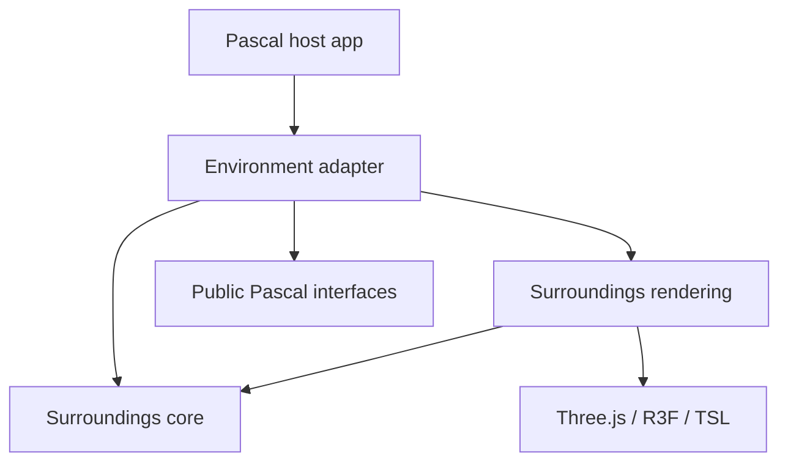
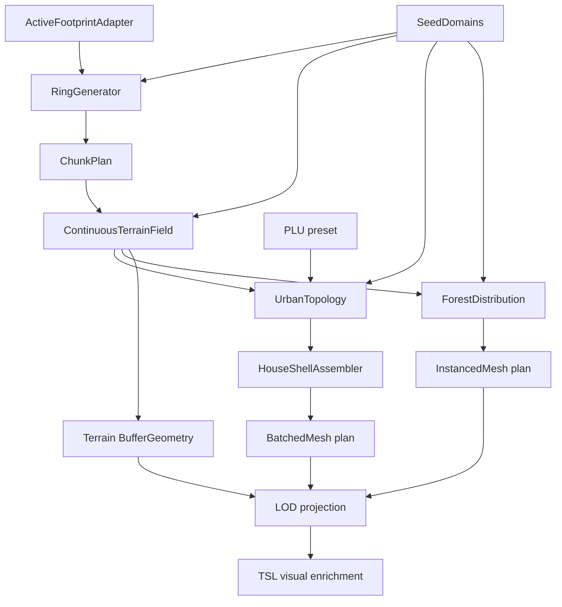

# Procedural Surroundings — Runtime Contract

> Status: approved technical direction, apprenticeship implementation not started.
> Source of planning truth: `docs/mission/SIX-DAY-PLAN.md`, section “Étude complémentaire — Procedural Surroundings”.

## Mission

Build a deterministic, runtime-generated presentation layer around the active Pascal footprint. The first vertical slice must make a filled urban or forest environment visible while preserving the authoring document, node evaluation, bake and export byte-for-byte wherever the exporter is deterministic.

The system is not an asset generator and not a second scene graph. It derives disposable presentation from read-only Pascal output.

```text
Pascal nodes → evaluated output / active footprint
                         ↓ read only
              surroundings generator
                         ↓
                 SurroundingsLayer
```

## Craft and learning contract

This project is built as a craftsman apprenticeship.

- Adam owns the consequential algorithms, visual grammar, PLU decisions, terrain character, shell silhouette and TSL behavior.
- The agent owns repository research, scaffolds, schemas, fixtures, red tests, repetitive integration, diagnostics and measurements.
- A production algorithm written by the agent must be explicitly labelled as agent-authored and does not count as learner evidence.
- Each slice changes one conceptual variable, reaches a visible result quickly and records a cold probe before the next slice.

The detailed sequence lives in `LEARNING-PATH.md`.

## Architectural roots

```text
THREE.Scene
├── scene-renderer                         AuthoringRoot de facto
└── environment-surroundings-root          presentation-derived
    ├── terrain-chunks
    ├── urban-shell-batches
    └── vegetation-instances
```

Invariants:

1. `environment-surroundings-root` is mounted through the public `Editor.viewerSceneSlot` / `Viewer.children` seam.
2. It is never a child of `scene-renderer`, a Pascal node group or the active `site` group.
3. No surroundings object receives a `pascalId` or registration in `sceneRegistry`.
4. Bake and export continue to start from `scene-renderer` only.
5. Disabling or regenerating the layer cannot mutate `useScene.nodes`, `rootNodeIds`, materials, collections or node metadata.
6. The layer owns and disposes its transient resources independently.

The first implementation may use the existing named authoring root. A typed `AuthoringRoot` reference is a hardening task, not a prerequisite, unless a tracer-bullet test proves the current public seam insufficient.

## Dependency direction



| Module | May know | Must not know |
|---|---|---|
| surroundings core | plain values, arrays, deterministic rules | React, Three.js, Pascal stores |
| surroundings rendering | core output, Three.js, R3F, TSL | editor internals, scene mutation |
| Environment adapter | core/rendering and public Pascal interfaces | private deep imports from `editor/` |
| Pascal host | generic composition through `viewerSceneSlot` | PLU, terrain-noise or shell-generation rules |

Stop before modifying Pascal when a plugin integration proves one exact missing public capability. The upstream proposal must expose the smallest generic capability rather than move Environment logic into Pascal.

## Operator graph



### ActiveFootprintAdapter

Input: read-only evaluated Pascal/site data.

Output: a `ReadonlySet<CellKey>` in integer grid coordinates.

It is the only module allowed to understand how the current Pascal scene becomes active cells. Every downstream operator works with arbitrary cells and never assumes a square or rectangle.

### RingGenerator

For candidate cell `c`:

```text
ring(c, footprint) =
  min over footprintCell:
    max(abs(c.x - footprintCell.x), abs(c.y - footprintCell.y))
```

It emits every non-active cell with `1 <= ring <= ringCount`, in canonical order. Ring controls representation, not existence.

Required fixtures:

- one active cell, ring 1: 8 cells;
- rectangular 4×2 footprint, ring 1: 16 cells;
- one active cell, rings 1–2: 8 cells in ring 1 and 16 in ring 2;
- empty footprint: empty result;
- `ringCount = 0`: empty result.

### SeedDomains

A master seed derives independent domains:

```text
topology · architecture · style · terrain · vegetation
```

Spatial variation is addressed by world coordinate and semantic domain. It must not consume one mutable PRNG stream in traversal order. Adding a ring or changing iteration order must not move existing roads, houses or trees.

### ContinuousTerrainField

`heightAtWorld(x, z, terrainSeed)` is CPU-authoritative and sampled in world coordinates.

- Shared world coordinates return bit-identical border heights.
- A transition band connects to the active Pascal terrain without mutating it.
- Macro amplitude grows smoothly outward from the active footprint, never radially from one center.
- Road corridors and buildable platforms modify the CPU field before geometry generation.
- TSL may add bounded visual micro-relief, but placement, bounds and culling remain based on CPU geometry.

### UrbanTopology and PLU

The urban operator builds continuous roads, then contiguous blocks and lots, then architecture descriptors. A lot may span several cells. Empty holes are forbidden unless intentionally reserved as a park or public space by the preset.

A PLU constrains:

- lot width and depth;
- street, side and rear setbacks;
- lot coverage and density;
- allowed floors and floor height;
- roof families and pitches;
- facade rhythm;
- wall and roof palettes;
- garden, fence and vegetation rules;
- archetype budget.

Variation happens inside the shared constraint family. A style-seed change cannot modify roads, lots, shell dimensions or terrain.

### HouseShellAssembler

Input descriptor:

```text
footprint · floors · floorHeight · lotCoverage
roofFamily · roofPitch · setbacks · facadeRhythm · palette
```

Output: lightweight transient `BufferGeometry` plus material-family metadata and bounds.

The assembler reuses public Pascal geometry primitives where appropriate, including slab and roof-shape foundations. It does not create `WallNode`, `SlabNode`, `RoofNode` or cloned author objects. If a neutral primitive is missing, a tracer bullet must demonstrate that before proposing a public Pascal extraction.

### ForestDistribution

The forest preset reuses the same footprint, rings, terrain and chunk plan.

- Density is a continuous world-space field.
- Candidate positions are deterministic by world cell.
- Clearings cross chunk borders.
- Near rings use detailed archetypes; far rings use reduced representations.
- Exact repetitions are represented through `InstancedMesh`.

### Representation and LOD

- Different house geometries sharing one material family use `BatchedMesh`.
- Exact repetitions use `InstancedMesh`.
- Geometry signatures quantize consequential dimensions and roof parameters.
- The PLU cache initially admits 12–16 unique house geometries.
- Ring 1 uses the richest approved representation; intermediate and far rings remain filled with progressively reduced geometry.
- TypeScript owns LOD selection, residency and bounds. TSL may hide transitions visually but does not decide topology.

## State model

The procedural model is deterministic and analytically reconstructible from:

```text
active footprint + config + derived seed domains + world coordinates
```

Chunk caches are operational state, not authored state. Every cached chunk can be deleted and reconstructed without information loss. Stateful WebGPU compute is explicitly rejected for the first version because no accumulated simulation, collision history or neighborhood feedback is required.

Compute may be reconsidered only after measurements for massive tree distribution, instance-buffer generation, culling or vegetation animation.

## CPU/GPU responsibilities

```text
TypeScript / CPU
├── footprint and rings
├── roads, lots and PLU constraints
├── authoritative macro terrain
├── Pascal primitive assembly
├── BufferGeometry, matrices and bounds
└── chunk invalidation
              ↓
      BatchedMesh / InstancedMesh
              ↓
WebGPU / TSL
├── procedural materials
├── facade variation
├── colors and visual parameters per instance
├── wind and foliage
├── visual LOD transitions
└── bounded world-space micro-relief
```

A GPU displacement must declare its maximum amplitude. Bounds must already contain that amplitude or the displacement must be too small to affect spatial correctness.

## Public runtime configuration

Defaults are provisional until the first visual calibration. Types and domains are contractual.

| Path | Type | Domain | Provisional default | Effect |
|---|---|---|---|---|
| `environment` | enum | `urban`, `forest` | `urban` | selects topology/population operators |
| `seed` | integer | signed 32-bit | `1` | derives all semantic seed domains |
| `ringCount` | integer | `1…6` | `3` | size of the generated surroundings window |
| `reliefAmplitude` | number | `0…12` m | `3` m | maximum macro-relief contribution away from the active footprint |
| `pluPreset` | string ID | registered local presets | `residential-balanced` | shared urban constraints and palettes |
| `density` | number | `0…1` | `0.65` | lot occupancy or vegetation density without changing ring topology |

Derived seed-domain values and chunk dimensions are diagnostic/internal. They do not become artist-facing controls until a user can manipulate them intentionally.

## Persistence

Allowed presentation state:

```text
environment · presetId · seed · ringCount · reliefAmplitude · density
```

The first slice keeps this state runtime-only in the Environment store because Pascal has no verified project-scoped presentation sidecar. It must not be hidden in a node or author mesh. Project persistence remains gated behind a generic host seam.

## Style-only versus topology changes

| Change | May update | Must remain stable |
|---|---|---|
| palette / style seed | material uniforms, colors, facade attributes | chunks, roads, lots, shells, terrain |
| density | population instances or occupancy according to preset contract | ring membership, terrain seed |
| relief amplitude | terrain vertices, platforms and dependent Y placement | roads/lots in XZ, style |
| topology seed | roads, blocks and lots | terrain and style seed domains |
| ring count | added/removed outer chunks | unchanged inner chunk signatures |
| active footprint | symmetric-difference chunks and changed LODs | unaffected chunk resource identity |

## Disposal contract

A regeneration constructs replacement resources before swapping them under `environment-surroundings-root`. Removed resources are disposed after the swap.

- Owned geometry and material resources emit one disposal.
- Shared cache entries use explicit ownership counts.
- `clear()` disposes all remaining cache resources on unmount.
- Ten regeneration/unmount cycles must not produce monotonically increasing renderer memory.

## Performance contract

Initial layer-wide budgets:

| Measurement | Budget |
|---|---|
| draw calls | ≤ 60 stable, shadow pass reported separately |
| visible triangles | ≤ 250,000 |
| owned buffers | ≤ 64 MiB |
| unique urban shell geometries per PLU | 12–16 |
| full nominal regeneration p95 | exploratory ≤ 100 ms CPU before swap |
| style-only update p95 | exploratory ≤ 16 ms CPU |

Measurements distinguish ring generation, terrain, topology, shell assembly, instance planning, GPU upload and scene swap.

## Required falsifiable contracts

1. 1×1 footprint produces eight ring-1 cells.
2. 4×2 footprint produces sixteen ring-1 cells.
3. Same inputs and seeds produce identical ordered output and checksums.
4. Changing style does not change topology, architecture or terrain checksums.
5. Surroundings activation and regeneration do not change node count or author serialization.
6. Surroundings activation does not change prepared bake/export output.
7. No surroundings object enters `sceneRegistry` or carries `pascalId`.
8. Repeated regeneration releases all unowned resources.
9. A local footprint edit rebuilds only affected chunks.
10. Adjacent terrain chunks share exact border heights.

## Visual acceptance

Fixed-camera comparisons cover 1×1 and 4×2 footprints in urban and forest presets with at least two seeds.

Human-only acceptance criteria:

- the environment is filled to its configured boundary without empty accidental holes;
- urban neighbors feel related by one PLU without obvious clones;
- terrain seams and tile boundaries are not visible;
- the active site joins softly into its surroundings;
- roads and house platforms read as intentionally constructed;
- clearings and vegetation masses cross chunk borders;
- outer limits are masked naturally rather than forming a circle or uniform wall;
- LOD reduction is progressive rather than a visible ring switch.

## Non-goals for the first vertical slice

- imported house or vegetation assets;
- authorable surroundings nodes;
- GIS, network providers or remote caches;
- WebGPU compute;
- physics, traffic or agent simulation;
- editable neighboring houses;
- project-scoped persistence before a generic presentation sidecar exists;
- Blender-first reconstruction of Pascal primitives;
- cinematic material completeness before the CPU contracts are green.

## Open human decisions

These remain explicit gates rather than hidden agent choices:

1. world cell size used by the active-footprint adapter;
2. first PLU’s visual identity and acceptable roof families;
3. terrain character and amplitude transfer curve;
4. tree archetype silhouettes and near/far representation threshold;
5. facade atlas/material vocabulary;
6. visual LOD transition style;
7. target platform and viewport for final budgets.

None blocks Lesson 1 because ring generation uses integer grid coordinates only.
